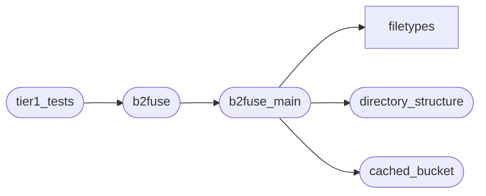

# Code Overview

[_Documentation generated by Documatic_](https://www.documatic.com)

<!---Documatic-section-Codebase Structure Python-start--->
## Codebase Structure Python

The codebase has a single-depth folder structure,
                with 11 code files in total.

<!---Documatic-block-system_architecture-start--->

<!---Documatic-block-system_architecture-end--->

# #
<!---Documatic-section-Codebase Structure Python-end--->

<!---Documatic-section-Important Functions-start--->
## Important Functions

<!---Documatic-block-important_funcs-start--->
<!---Documatic-block-most_used_funcs-start--->
### Most Utilised Functions

* [b2fuse.b2fuse.load_config](3-b2fuse_b2fuse.md#b2fuse.b2fuse.load_config) (1 times)
<!---Documatic-block-most_used_funcs-end--->
<!---Documatic-block-important_funcs-end--->

# #
<!---Documatic-section-Important Functions-end--->

<!---Documatic-section-File IO-start--->
## File IO

<!---Documatic-block-file_io-start--->
The following files have file read operations

<!---Documatic-block-b2fuse-start--->

	
<code>b2fuse</code> (Click to Expand!)

* b2fuse.b2fuse
* b2fuse.tier1_tests

<!---Documatic-block-b2fuse-end--->

<!---Documatic-block-b2fuse.filetypes-start--->

	
<code>b2fuse.filetypes</code> (Click to Expand!)

* b2fuse.filetypes.B2FileDisk

<!---Documatic-block-b2fuse.filetypes-end--->

The following files have file write operations

<!---Documatic-block-b2fuse-start--->

	
<code>b2fuse</code> (Click to Expand!)

* b2fuse.tier1_tests

<!---Documatic-block-b2fuse-end--->
<!---Documatic-block-file_io-end--->

# #
<!---Documatic-section-File IO-end--->

<!---Documatic-section-Class Hierarchy-start--->
## Class Hierarchy

<!---Documatic-block-BaseException-start--->

	
<code>BaseException</code> (Click to Expand!)

* b2fuse.cached_bucket.CacheNotFound

<!---Documatic-block-BaseException-end--->

<!---Documatic-block-b2fuse.cached_bucket.CachedBucket-start--->

	
<code>b2fuse.cached_bucket.CachedBucket</code> (Click to Expand!)

* b2fuse.cached_bucket.CachedBucket

<!---Documatic-block-b2fuse.cached_bucket.CachedBucket-end--->

<!---Documatic-block-object-start--->

	
<code>object</code> (Click to Expand!)

* b2fuse.cached_bucket.Cache
* b2fuse.directory_structure.Directory
* b2fuse.directory_structure.DirectoryStructure

<!---Documatic-block-object-end--->

<!---Documatic-block-unittest.TestCase-start--->

	
<code>unittest.TestCase</code> (Click to Expand!)

* b2fuse.tier1_tests.TestCreateAndRandomWrite
* b2fuse.tier1_tests.TestCreateFileInFolder
* b2fuse.tier1_tests.TestCreateFolder
* b2fuse.tier1_tests.TestCreateWriteCopy
* b2fuse.tier1_tests.TestCreateWriteMove

<!---Documatic-block-unittest.TestCase-end--->

# #
<!---Documatic-section-Class Hierarchy-end--->

[_Documentation generated by Documatic_](https://www.documatic.com)