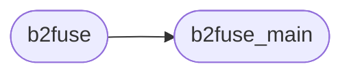
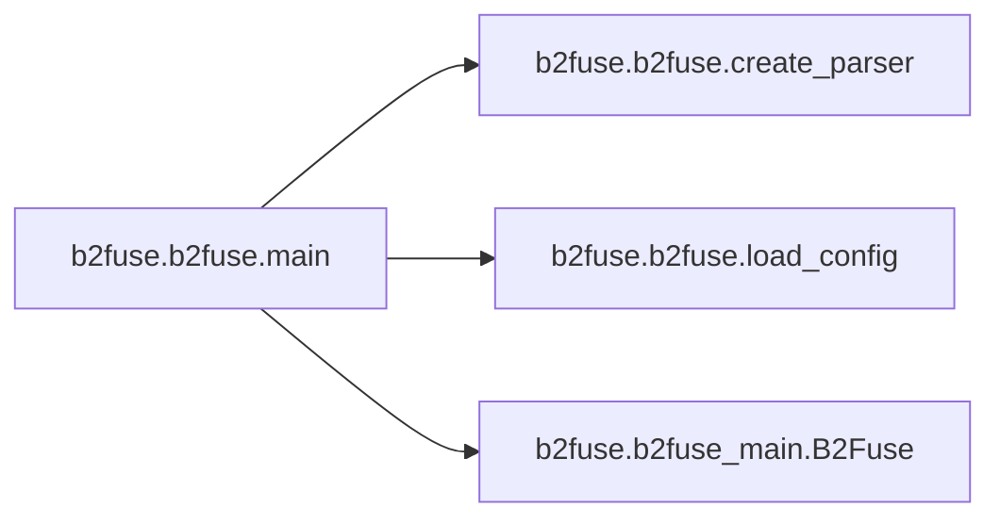

# B2fuse B2fuse

[_Documentation generated by Documatic_](https://www.documatic.com)

<!---Documatic-section-Codebase Structure-start--->
## Codebase Structure

<!---Documatic-block-system_architecture-start--->

<!---Documatic-block-system_architecture-end--->

# #
<!---Documatic-section-Codebase Structure-end--->

<!---Documatic-section-b2fuse.b2fuse.create_parser-start--->
## [b2fuse.b2fuse.create_parser](3-b2fuse_b2fuse.md#b2fuse.b2fuse.create_parser)

<!---Documatic-section-create_parser-start--->
<!---Documatic-block-b2fuse.b2fuse.create_parser-start--->
<details>
	<summary><code>b2fuse.b2fuse.create_parser</code> code snippet</summary>

```python
def create_parser():
    parser = argparse.ArgumentParser()
    parser.add_argument('mountpoint', type=str, help='Mountpoint for the B2 bucket')
    parser.add_argument('--enable_hashfiles', dest='enable_hashfiles', action='store_true', help='Enable normally hidden hashes as exposed by B2 API')
    parser.set_defaults(enable_hashfiles=False)
    parser.add_argument('--version', action='version', version='B2Fuse version 1.3')
    parser.add_argument('--use_disk', dest='use_disk', action='store_true')
    parser.set_defaults(use_disk=False)
    parser.add_argument('--debug', dest='debug', action='store_true')
    parser.set_defaults(debug=False)
    parser.add_argument('--account_id', type=str, default=None, help='Account ID for your B2 account (overrides config)')
    parser.add_argument('--application_key', type=str, default=None, help='Application key for your account  (overrides config)')
    parser.add_argument('--bucket_id', type=str, default=None, help='Bucket ID for the bucket to mount (overrides config)')
    parser.add_argument('--temp_folder', type=str, default='.tmp/', help='Temporary file folder')
    parser.add_argument('--config_filename', type=str, default='config.yaml', help='Config file')
    parser.add_argument('--allow_other', dest='allow_other', action='store_true')
    parser.set_defaults(allow_other=False)
    return parser
```
</details>
<!---Documatic-block-b2fuse.b2fuse.create_parser-end--->
<!---Documatic-section-create_parser-end--->

# #
<!---Documatic-section-b2fuse.b2fuse.create_parser-end--->

<!---Documatic-section-b2fuse.b2fuse.load_config-start--->
## [b2fuse.b2fuse.load_config](3-b2fuse_b2fuse.md#b2fuse.b2fuse.load_config)

<!---Documatic-section-load_config-start--->
<!---Documatic-block-b2fuse.b2fuse.load_config-start--->
<details>
	<summary><code>b2fuse.b2fuse.load_config</code> code snippet</summary>

```python
def load_config(config_filename):
    with open(config_filename) as f:
        return yaml.load(f.read())
```
</details>
<!---Documatic-block-b2fuse.b2fuse.load_config-end--->
<!---Documatic-section-load_config-end--->

# #
<!---Documatic-section-b2fuse.b2fuse.load_config-end--->

<!---Documatic-section-b2fuse.b2fuse.main-start--->
## [b2fuse.b2fuse.main](3-b2fuse_b2fuse.md#b2fuse.b2fuse.main)

<!---Documatic-section-main-start--->


### Object Calls

* [b2fuse.b2fuse.create_parser](3-b2fuse_b2fuse.md#b2fuse.b2fuse.create_parser)
* [b2fuse.b2fuse.load_config](3-b2fuse_b2fuse.md#b2fuse.b2fuse.load_config)
* b2fuse.b2fuse_main.B2Fuse

<!---Documatic-block-b2fuse.b2fuse.main-start--->
<details>
	<summary><code>b2fuse.b2fuse.main</code> code snippet</summary>

```python
def main():
    parser = create_parser()
    args = parser.parse_args()
    if args.debug:
        logging.basicConfig(level=logging.INFO, format='%(asctime)s:%(levelname)s:%(message)s')
    else:
        logging.basicConfig(level=logging.WARNING, format='%(asctime)s:%(levelname)s:%(message)s')
    if args.config_filename:
        config = load_config(args.config_filename)
    else:
        config = {}
    if args.account_id:
        config['accountId'] = args.account_id
    if args.application_key:
        config['applicationKey'] = args.application_key
    if args.bucket_id:
        config['bucketId'] = args.bucket_id
    if args.enable_hashfiles:
        config['enableHashfiles'] = args.enable_hashfiles
    else:
        config['enableHashfiles'] = False
    if args.temp_folder:
        config['tempFolder'] = args.temp_folder
    if args.use_disk:
        config['useDisk'] = args.use_disk
    else:
        config['useDisk'] = False
    args.options = {}
    if args.allow_other:
        args.options['allow_other'] = True
    with B2Fuse(config['accountId'], config['applicationKey'], config['bucketId'], config['enableHashfiles'], config['tempFolder'], config['useDisk']) as filesystem:
        FUSE(filesystem, args.mountpoint, nothreads=True, foreground=True, **args.options)
```
</details>
<!---Documatic-block-b2fuse.b2fuse.main-end--->
<!---Documatic-section-main-end--->

# #
<!---Documatic-section-b2fuse.b2fuse.main-end--->

[_Documentation generated by Documatic_](https://www.documatic.com)