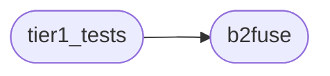
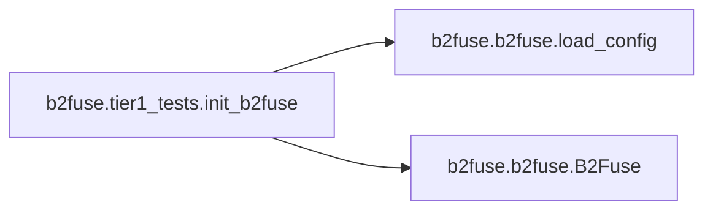

# B2fuse Tier1 Tests

[_Documentation generated by Documatic_](https://www.documatic.com)

<!---Documatic-section-Codebase Structure-start--->
## Codebase Structure

<!---Documatic-block-system_architecture-start--->

<!---Documatic-block-system_architecture-end--->

# #
<!---Documatic-section-Codebase Structure-end--->

<!---Documatic-section-b2fuse.tier1_tests.init_b2fuse-start--->
## b2fuse.tier1_tests.init_b2fuse

<!---Documatic-section-init_b2fuse-start--->


### Object Calls

* [b2fuse.b2fuse.load_config](3-b2fuse_b2fuse.md#b2fuse.b2fuse.load_config)
* b2fuse.b2fuse.B2Fuse

<!---Documatic-block-b2fuse.tier1_tests.init_b2fuse-start--->
<details>
	<summary><code>b2fuse.tier1_tests.init_b2fuse</code> code snippet</summary>

```python
def init_b2fuse():
    config = load_config('config.yaml')
    os.makedirs('mountpoint')
    filesystem = B2Fuse(config['accountId'], config['applicationKey'], config['bucketId'], config['enableHashfiles'], config['memoryLimit'], config['tempFolder'], config['useDisk'])
    fuse = FUSE(filesystem, 'mountpoint', nothreads=True, foreground=False)
    return fuse
```
</details>
<!---Documatic-block-b2fuse.tier1_tests.init_b2fuse-end--->
<!---Documatic-section-init_b2fuse-end--->

# #
<!---Documatic-section-b2fuse.tier1_tests.init_b2fuse-end--->

[_Documentation generated by Documatic_](https://www.documatic.com)